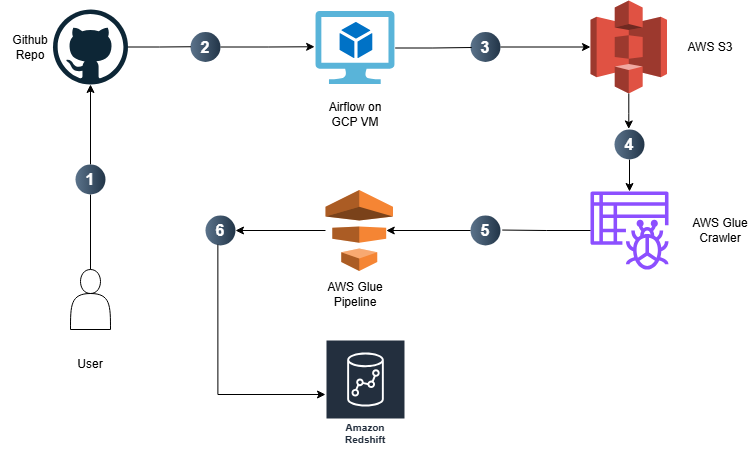

# Cloud-Based ETL Data Pipeline using AWS Services 

## 📘 Project Overview
This project demonstrates a cloud-based ETL (Extract–Transform–Load) data pipeline built using Apache Airflow on GCP and AWS services (S3, Glue, Data Catalog).
It automates the extraction of NYC Green Taxi Trip data, transforms and stores it as Parquet files, and registers datasets for analytics and future transformations.

---
## 🔁 System Architecture


- 1️⃣ The developer writes or updates Airflow DAGs and ETL scripts locally.
Once the code is ready, it’s pushed to a GitHub repository. This repo serves as the single source of truth for all DAGs and pipeline scripts.
- 2️⃣ A GCP Virtual Machine hosts Apache Airflow, which is configured to automatically pull the latest DAGs from the GitHub repository.
Whenever a developer pushes code, the DAGs folder on the GCP VM is synced, ensuring Airflow always runs the most up-to-date workflow.
- 3️⃣ Airflow orchestrates the ETL job. The DAG extracts NYC Green Taxi Trip data (from the public dataset URL), processes it into Parquet format, and uploads the latest 12 months of data to an AWS S3 bucket.
- 4️⃣ Once new data lands in S3, an AWS Glue Crawler is triggered.
The crawler scans the S3 bucket, infers the schema, and registers metadata in the AWS Glue Data Catalog, making the data discoverable and queryable across AWS services
- 5️⃣ Using the cataloged data, AWS Glue ETL Jobs can now perform transformations, cleansing, or enrichment tasks.
- 6️⃣ The processed data from Glue is (or will be) loaded into Amazon Redshift, enabling SQL-based analytics and integration with BI tools such as QuickSight, Tableau, or Looker
---
## 📂 Repository Structure
```
cloud-airflow-data-pipeline/
│
├── dags/                     # Airflow DAGs that define ETL workflows
│   └── NYC_Taxi_Data_Pipeline_aws.py   # DAG to extract and upload NYC Taxi data
│
├── scripts/                  # Helper & setup scripts
│   └── setup_vm.sh           # Initializes GCP VM and sets up environment
│
├── assets/images             # Diagrams, screenshots, and visual documentation
│   └── architecture.png      # ETL architecture diagram
    └── demo_dag.png          # Demo Airflow DAG
│
├── .github/
│   └── workflows/ci_cd.yml   # CI/CD pipeline for syncing DAGs to Airflow VM
│
├── requirements.txt          # Python dependencies for DAGs and scripts
│
├── LICENSE                   # License file (MIT or similar)
│
└── README.md                 # Project documentation
```
## ⚙️ Setup
1. Prerequisites
    * Google Cloud Platform (GCP) account.
    * A running Ubuntu VM instance in GCP
    * Open firwall ports:
        * 22 -> SHH
        * 8080 -> Airflow Web UI
    * GitHub Repository with you DAGs and pipeline code.

2. Install Docker & Airflow on the VM
    - SSH into your VM:
    `ssh <your-username>@<your-vm-external-ip>` 
    - Then run the installation script:
    ```
    chmod +x ./scripts/setup_vm.sh
    ./scripts/setup_vm.sh
    ```  
    - This will:
        * Install Docker Engine and Docker Compose
        * Download Airflow 3.0.6 docker-compose.yaml.
        * Creates folders (`/dags`, `./plugins`, `/logs`).
        * Initialize Airflow and start services.

    - After installation, open Airflow UI in your browser:
    `http://<your-vm-external-ip>:8080`


3. Setup SSH Keys for CI/CD
    - On your local machine:\
    `ssh-keygen -t rsa -b 4096 -C "your_email@example.com"`

    * `id_rsa` → private key (add as GitHub secret: `GCP_SSH_KEY`).
    * `id_rsa.pub` → public key (add to VM: `~/.ssh/authorized_keys`).

    - Also add the following GitHub repo secrets:

    * `GCP_VM_HOST` = \<your-vm-ip\>
    * `GCP_VM_USER` = \<your-vm-username\>

## ▶️ Usage

* Add new DAGs to dags/ folder.

* Push changes to main branch.

* GitHub Actions deploys automatically.

* Check Airflow UI (http://\<vm-ip>\:8080) for new DAGs.
